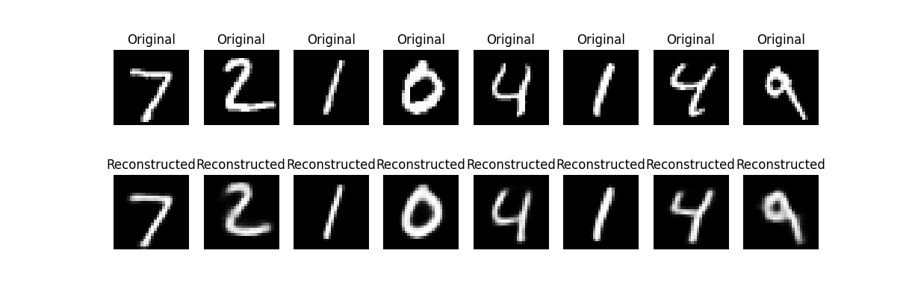

# Custom Vector-Quantized Variational Autoencoder (VQ-VAE)

A Python project implementing various autoencoder models including:

- **AE** (Autoencoder)  
  - Standard autoencoder: learns a compressed latent representation of the input.  
  - The latent space has **no explicit distribution constraints**, so it captures features purely for reconstruction.

- **VAE** (Variational Autoencoder)  
  - The latent space is **regularized to follow a standard normal distribution** $\mathcal{N}(0, 1) $.
  - This allows smooth interpolation in the latent space and generative sampling.

- **Beta-VAE** (VAE with β regularization)  
  - Extends the VAE by introducing a **β weight on the KL divergence** term.  
  - Encourages **disentangled latent representations**, making each latent dimension capture independent factors of variation.

- **VQ-VAE** (Vector-Quantized VAE)  
  - The latent space is **discrete**, mapped to a finite set of embedding vectors.  
  - Useful for **discrete representation learning**, compression, and tasks like generative modeling with autoregressive priors.

### Training over the **MNIST dataset** :



---

## Quick Usage

### 1. Create virtual environment and install dependencies

```bash
make
```

### 2. Train a model with default model & hyperparameters from config (single run)

```bash
make train 
```

You can override parameters with Hydra, e.g.:
```bash
python train.py model=vq_vae training.epochs=5 training.optimizer.lr=1e-3
```

### 3. Run a Hydra multirun (sweep)

```bash
make sweep PARAMS="model=vq_vae training.epochs=3,5,7 training.optimizer.lr=5e-3,1e-3"
```
This launches all combinations of the parameter values.
Each run gets its own output folder under **outputs/YYYY-MM-DD_HH-MM-SS/**.

## Available Parameters

All parameters are configurable via Hydra in the **`config/`** directory:

- **model**
  - `ae` — Autoencoder  
  - `vae` — Variational Autoencoder  
  - `beta_vae` — Beta-VAE  
  - `vq_vae` — Vector-Quantized VAE  

- **training**
  - `epochs` — number of training epochs  
  - `batch_size` — batch size  
  - `optimizer`  
    - `name` — optimizer type (e.g., `adam`, `sgd`)  
    - `lr` — learning rate  
    - `weight_decay` — weight decay for regularization  
  - `device` — `"cuda"`, `"cpu"`, or `"auto"`  

- **visualization**
  - `active` — enable or disable visualization  
  - `n_samples` — number of images to visualize  

- **evaluation**
  - `active` — enable or disable evaluation  


> Override any parameter directly from the command line using Hydra syntax. For example:

```bash
python train.py model=vae training.epochs=10 training.optimizer.lr=1e-3 visualization.n_samples=16
```

## Outputs

Hydra automatically creates per-run output directories:

- `outputs/YYYY-MM-DD_HH-MM-SS/`

    - `train.log`: logs for the run

    - `plot/`: reconstructed images for the model

Each multirun or sweep creates a separate folder, so runs do not overwrite each other.

## Makefile Commands

```bash
make train              # Run single training
make sweep PARAMS="..." # Run Hydra multirun
make clean              # Remove temporary files, virtualenv, outputs
make all                # Show help
```
